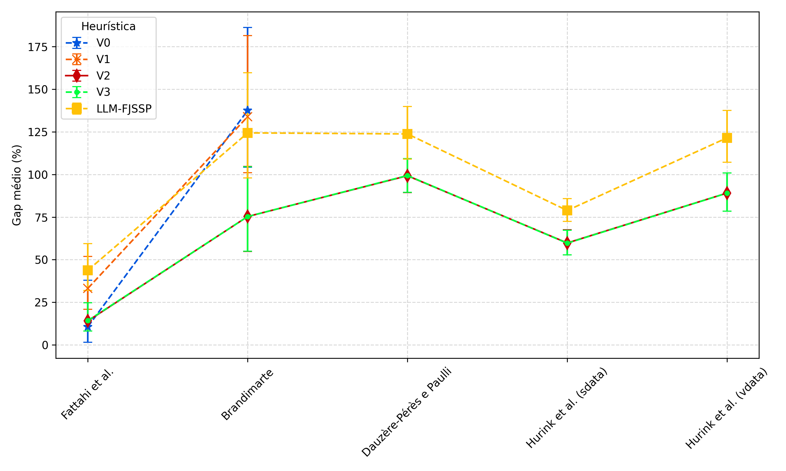
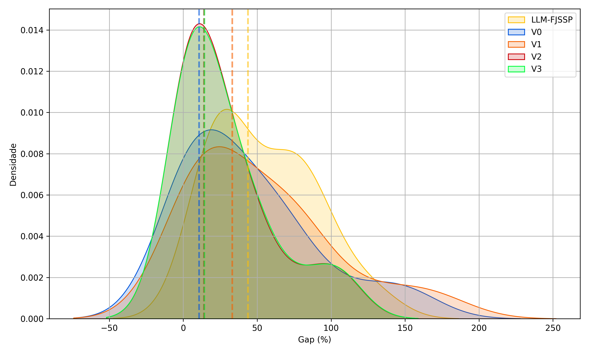
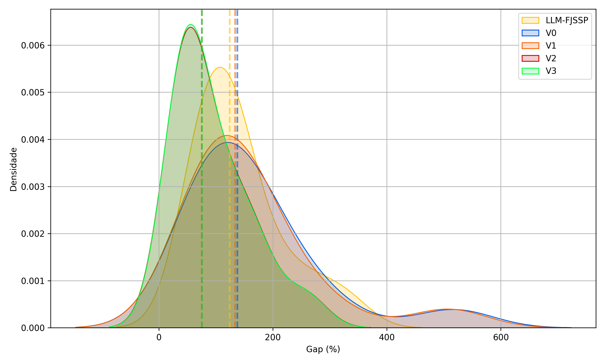
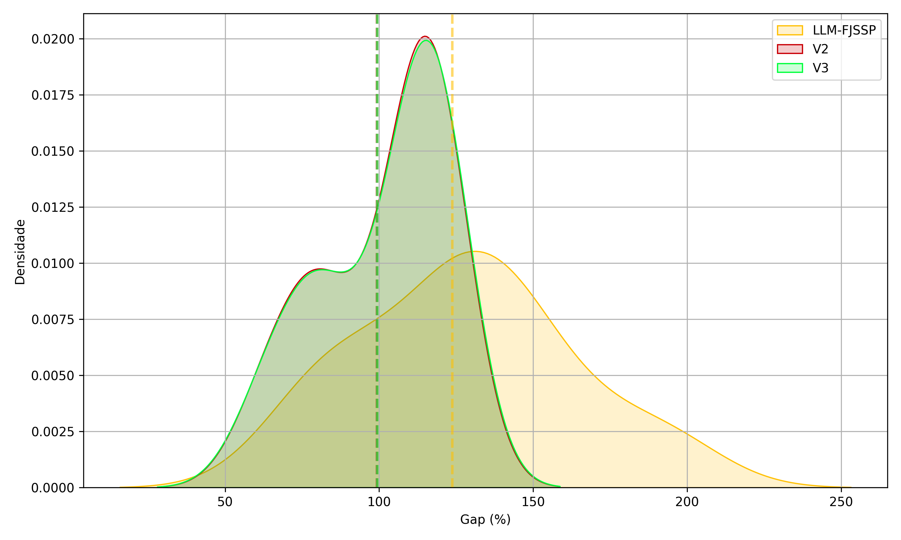
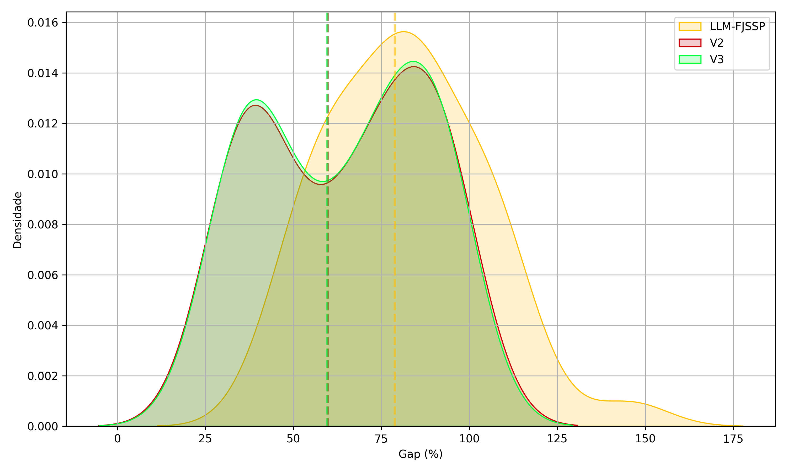
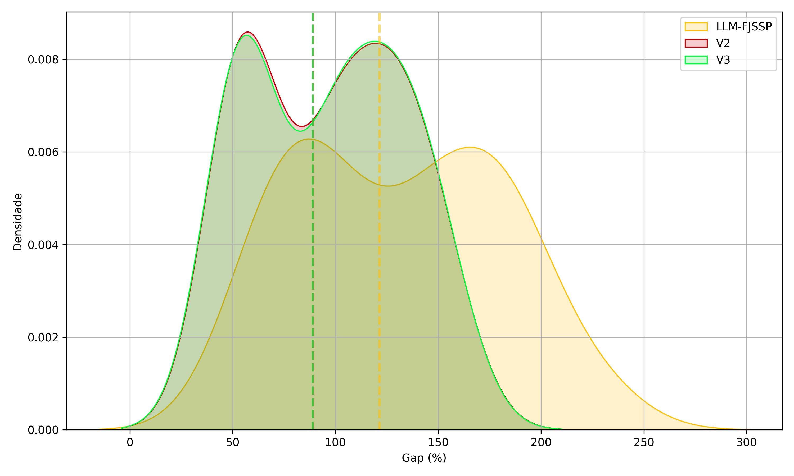

# SchedulingAlgorithmsRuns
# Resultados do TCC — FJSSP com ACO

Este repositório contém os resultados experimentais do trabalho **"O Escalonador dos Papéis: Abordagens heurísticas com colônias de formigas para o escalonamento flexível de trabalhos no contexto da indústria gráfica"** [Disponível neste repositório](https://github.com/mrsixx/SchedulingAlgorithms), cujo foco foi a aplicação de algoritmos baseados em Otimização por Colônia de Formigas (ACO) ao problema de escalonamento **Flexible Job Shop (FJSSP)**. As instâncias criadas diretamente para esse trabalho se encontram [neste link](https://www.kaggle.com/datasets/mrsixx/fjssp-ribeirosuzarte-instances/data).

## 🔍 Problema estudado

O **FJSSP (Flexible Job Shop Scheduling Problem)** é uma generalização do clássico problema de job shop, no qual cada operação pode ser processada por mais de uma máquina. O objetivo principal é minimizar o **makespan** (tempo total necessário para concluir todas as tarefas).

## 🐜 Abordagem

Foram desenvolvidos e analisados **32 algoritmos ACO**, agrupados conforme a heurística construtiva utilizada. As versões paralelas utilizam a biblioteca **PLINQ** em C# para execução multi-thread.

### Conjuntos de algoritmos:

- **LLM**: Algoritmo guloso baseado em LLM-FJSSP;
- **V0**: ACSV0-p, ACSV0-i;
- **V1**: ASV1-p, ASV1-i, EASV1-p, EASV1-i, RBASV1-p, RBASV1-i, MMASV1-p, MMASV1-i, ACSV1-p, ACSV1-i;
- **V2**: ASV2-p, ASV2-i, EASV2-p, EASV2-i, RBASV2-p, RBASV2-i, MMASV2-p, MMASV2-i, ACSV2-p, ACSV2-i;
- **V3**: ASV3-p, ASV3-i, EASV3-p, EASV3-i, RBASV3-p, RBASV3-i, MMASV3-p, MMASV3-i, ACSV3-p, ACSV3-i.

## 📚 Instâncias Utilizadas

As instâncias clássicas do FJSSP utilizadas nos experimentos foram:

- Fattahi et al. (2007)
- Brandimarte (1993)
- Dauzère-Pérès e Paulli (1997)
- Hurink et al. (1994)

## 📊 Gráficos

Os gráficos gerados detalham o desempenho dos algoritmos em termos de makespan, tempo de execução e distribuição de qualidade das soluções. Abaixo, os links para os principais gráficos:

### 📌 Gráfico de Síntese

## 📄 Gráfico de síntese geral (comparação dos gaps entre conjuntos)

### 📈 Curvas de densidade de probabilidade dos gaps médios (estimadas por KDE) de cada instância

## Fattahi et al. (2007)

## Brandimarte (1993)

## Dauzère-Pérès e Paulli (1997)

## Hurink et al. (1994) - sdata

## Hurink et al. (1994) - vdata

## 💻 Ambiente de Execução

Os experimentos foram executados em:

- Processador: Intel(R) Core(TM) i7-8700 CPU @ 3.20GHz
- Memória RAM: 16 GB
- Sistema operacional: Kubuntu 24.04
- Plataforma de desenvolvimento: C# 12 com .NET 8 e PLINQ

---

Made with ☕ and 🧠 by [Matheus]
